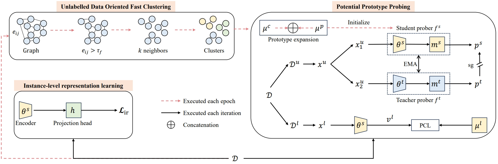

## PNP
Beyond Known Clusters: Probe New Prototypes for Efficient Generalized Class Discovery

<div align="center">

</div>


Generalized Class Discovery (GCD) aims to dynamically assign labels to unlabelled data partially based on knowledge learned from labelled data, where the unlabelled data may come from known or novel classes. The prevailing approach generally involves clustering across all data and learning conceptions by prototypical contrastive learning. However, existing methods largely hinge on the performance of clustering algorithms and are thus subject to their inherent limitations. Firstly, the estimated cluster number is often smaller than the ground truth, making the existing methods suffer from the lack of prototypes for comprehensive conception learning. To address this issue, we propose an adaptive probing mechanism that introduces learnable potential prototypes to expand cluster prototypes (centers). As there is no ground truth for the potential prototype, we develop a self-supervised prototype learning framework to optimize the potential prototype in an end-to-end fashion. Secondly, clustering is computationally intensive, and the conventional strategy of clustering both labelled and unlabelled instances exacerbates this issue. To counteract this inefficiency, we opt to cluster only the unlabelled instances and subsequently expand the cluster prototypes with our introduced potential prototypes to fast explore novel classes. 
Despite the simplicity of our proposed method, extensive empirical analysis on a wide range of datasets confirms that our method consistently delivers state-of-the-art results. Specifically, our method surpasses the nearest competitor by a significant margin of 9.7$\%$ within the Stanford Cars dataset and 12$\times$ clustering efficiency within the Herbarium 19 dataset.

### Scripts

**Train the model**:

```
bash scripts/run_cars.sh
```

## Acknowledgements

The codebase is largely built on this repo: https://github.com/CVMI-Lab/SimGCD.

## Citations
If you find this repo useful for your research, please consider citing our paper:
```
@misc{wang2024known,
      title={Beyond Known Clusters: Probe New Prototypes for Efficient Generalized Class Discovery}, 
      author={Ye Wang and Yaxiong Wang and Yujiao Wu and Bingchen Zhao and Xueming Qian},
      year={2024},
      eprint={2404.08995},
      archivePrefix={arXiv},
      primaryClass={cs.LG}
}
```